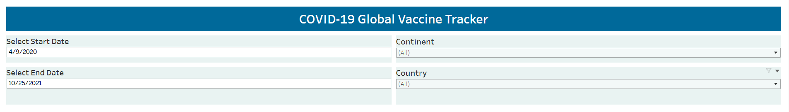

# [COVID-19 Global Vaccination Tracker](https://public.tableau.com/views/COVID-19GlobalVaccinationTracker_16850851988440/COVID-19GlobalVaccineTracker?:language=en-US&:display_count=n&:origin=viz_share_link)

## Introduction

This is a COVID-19 Global Vaccination Tracker Dashboard created using Tableau. The dashboard is created using Tableau
Public. You can filter the data to modify the dashboard visualization as per your needs. The complete dashboard is hosted in Github pages. You can view the dashboard [here](https://mohitur669.github.io/COVID-19-Vaccination-Tracker/).

## Data Source

The data is taken from [Our World in Data](https://ourworldindata.org/covid-vaccinations). The data source was last
updated on 25/10/2021.

## Dashboard

The dashboard is created using Tableau
Public. The dashboard is interactive, and you can hover over the charts to get more information. You can also filter the
data by Start Date, End Date, Continent Name & Country Name.

The dash contains 5 sections/parts: 
1. **Data Filtering**: Here you can filter the
   data by selecting Start Date, End Date, Continent Name & Country Name as per your choice.

2. **What share of the population has been partly or fully vaccinated against COVID-19?**: This

The dashboard is embedded below. You can also view the
dashboard [here](https://mohitur669.github.io/COVID-19-Vaccination-Tracker/).

## Sheets
The dashboard is created using 6 sheets. In every sheet, You can filter the data by Start Date, End Date, Continent Name & Country Name. The sheets are:
1. **Vaccinated People (KPIs)**: This sheet shows the maximum number of people who got at least one dose of vaccinations (Partially Vaccinated).
2. **Fully Vaccinated People (KPIs)**: This sheet shows the maximum number of people who got fully vaccinated.
3. **% Not Vaccinated People (KPIs)**: This sheet shows the percentage of people who do not have any dose of vaccinations.
4. **Partially Vaccinated vs Fully Vaccinated per Location (Bar Graph)**: This sheet shows the horizontal bar graph of partially vaccinated vs fully vaccinated people per location.
5. **Vaccination per Hundred - World Map**: This sheet shows the world map of vaccination per hundred people.
6. **Vaccination over GDP**: This sheet shows the scatter plot of how vaccination is related to GDP (Max. GDP Per Capita vs Max. People Vaccinated per Hundred). It also shows us a trend-line.